# Soccer Game Experiment (Friend-Q, Foe-Q, and CE-Q) ([Report](report_final.pdf))

## Introduction

This project aimed to replicate the results of the Soccer Game experiment as presented in Amy Greenwald, Keith Hall, and Roberto Serrano's paper [1] titled "Correlated Q-Learning." The study explored the performance of different reinforcement learning algorithms, including Q-Learning, Friend-Q, Foe-Q, and Correlated-Q (CE-Q) in the context of a Soccer Game scenario.The report delves into a comprehensive analysis of Nash equilibrium, correlated equilibrium, and Markov games. All algorithms, including Q-Learning, Friend-Q, Foe-Q, and CE-Q, were built from scratch to ensure a thorough understanding of their implementation and functioning. Please check more details in the [final report](/report_final.pdf).

    <figure>
        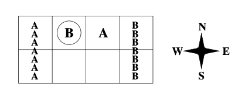
        <figcaption>Soccer Game</figcaption>
    </figure>

## Background

The Soccer Game experiment presented in [1] investigates how different reinforcement learning algorithms fare in a multi-agent environment where two teams compete against each other. The agents learn to optimize their strategies through repeated interactions.

## Algorithms

1. **Q-Learning**: Q-learning, an off-policy learning algorithm, is one of the early breakthroughs in reinforcement learning. It learns the action-value function Q and directly approximates the optimal action-value 𝑞∗ . For Q-learning, it does not consider its opponent’s action which means Player A and B have their own Q table and update independently. The update rule is defined as:
   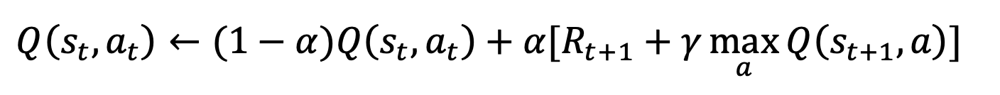
   where 𝑠𝑡 is the current state; 𝑠𝑡+1 is the next state; 𝑎𝑡 is the player’s action; 𝛼 is the learning rate; 𝑅𝑡+1 is the reward of action; 𝛾 is the discount factor.

2. **Friend-Q**:Coordination equilibrium is a special kind of Nash equilibrium. In a coordination equilibrium ,all players achieve their highest possible values:
   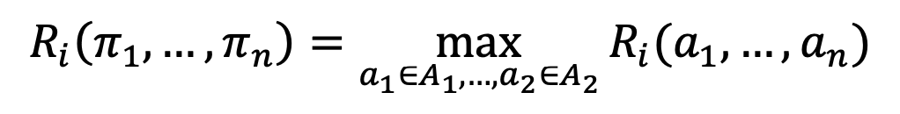
   Friend-Q works on the principle of coordination equilibrium which all players’ reward functions are equivalent, and the idea is simply that 𝑖 ’s friends are assumed to work together to maximize 𝑖’s value. The main difference between Q-learning and Friend-Q is that the latter one’s actions are formed in joint pair. In other words, it takes the opponent’s action into account. Therefore, only one Q table is needed for Friend-Q. The update rule is defined as:
   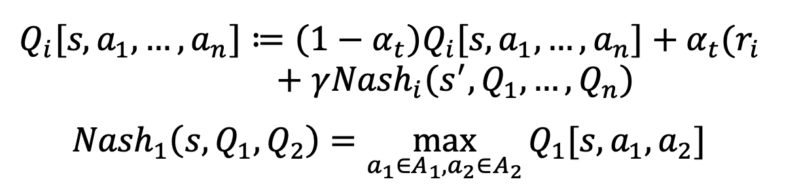
   It shows that the optimal value is from the joint action that maximize the Q value since we consider the two players are friends.

3. **Foe-Q**:Adversarial equilibrium is another special case of Nash equilibria. It has the property that no player 𝑖 is hurt by any change of the other players:
   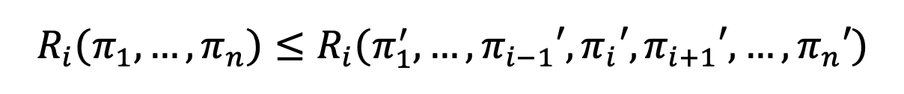
   Foe-Q is to find the adversarial equilibrium which 𝑖’s foe is working together to minimize 𝑖’s value. Just like Friend-Q, Foe- Q also considers opponent’s action and only need one Q table. However, the update rule is different since the opponent is a foe not friend here:
   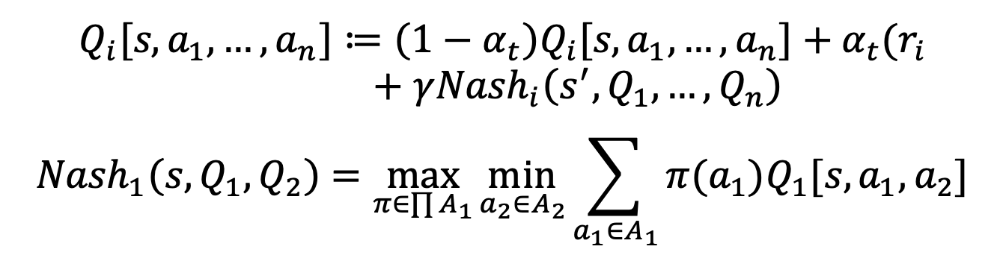
   Foe-Q is based on the minimax-Q algorithm provided by Littman [4]. The objective is to maximize the worst case over all actions that the opponent can execute which means we consider the opponent is fully adversarial. The Foe-Q can be solved with linear programming.

4. **CE-Q**: CE-Q, based on correlated equilibrium solution concept, generalizes both Friend-Q and Foe-Q. The set of correlated equilibria contains the set of Nash equilibria in general-sum games. In constant-sum games, where Nash and minimax equilibria coincide, the set of correlated equilibria contains the set of minimax equilibria. The main difficulty in learning equilibrium policies in Markov games is the equilibrium selection problem due to the existence of multiple equilibria. Greenwald introduced four variants of CE-Q, based on four different equilibrium selection functions, to solve this issue. The four CE-Qs are described below:
   - Utilitarian CE-Q (uCE-Q): Maximize the sum of the players’ rewards
     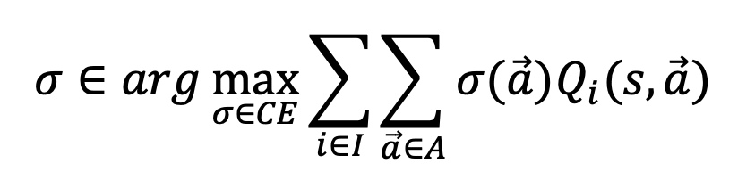
   - Egalitarian CE-Q (eCE-Q): Maximize the minimum of the players’ rewards
     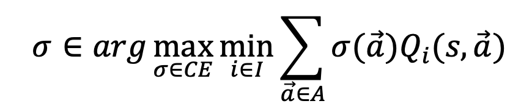
   - Republican CE-Q (rCE-Q): Maximize the maximum of the players’ rewards
     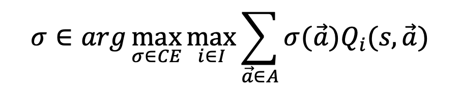
   - Libertarian CE-Q (lCE-Q)Maximize the maximum of each individual player I’s rewards:
     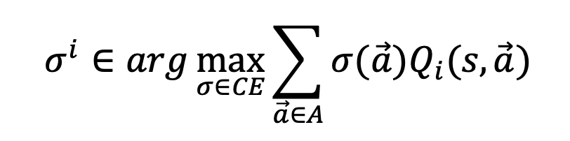
     The value function is
     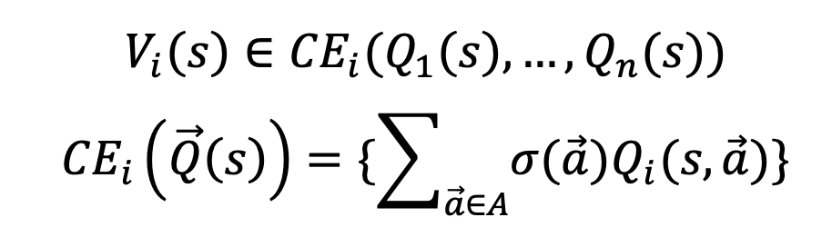
     where σ satisfies the four CE-Q defined above.

All of the four CE-Q can be solved via linear programming with the probability and rationality constraints. The rationality constraints means that the expected rewards to play the recommended policy is no worse than playing any other policy.

## Methodology

To ensure a comprehensive understanding of the algorithms, the following approach was taken:

1. **Literature Review**: The paper [1] was thoroughly studied to grasp the core concepts of Q-Learning, Friend-Q, Foe-Q, and Correlated-Q algorithms. Understanding the underlying mathematics and principles was a priority.

2. **Environment Setup**: A simulation environment was created to mimic the Soccer Game scenario, allowing agents to interact, learn, and adapt their strategies based on the reinforcement learning algorithms.

3. **Algorithm Implementation**: Instead of relying on existing libraries, each algorithm was implemented from scratch. This approach involved designing the state and action spaces, initializing Q-tables, and implementing the learning and exploration-exploitation policies.

4. **Data Collection**: The agents were allowed to interact in the Soccer Game environment, and data on their performance and learning progress were collected.

5. **Performance Evaluation**: Various performance metrics, such as the number of goals scored, successful passes, and win rates, were calculated to assess the effectiveness of each algorithm.

6. **Graphical Representation**: The collected data was visualized through graphs and plots, aiming to replicate Figure 3 (parts a-d) from the original paper.

## Results

The results of the Soccer Game experiment from custom implementations were analyzed and discussed in the [final report](/report_final.pdf).

## Conclusion

This project successfully replicated the Soccer Game experiment from Amy Greenwald, Keith Hall, and Roberto Serrano's paper [1]. The study reaffirmed the superior performance of Correlated-Q (CE-Q) over Q-Learning, Friend-Q, and Foe-Q algorithms in a multi-agent environment.

The experience gained from this replication project further deepened the understanding of reinforcement learning algorithms and their applicability in complex scenarios involving multiple agents.

Building the algorithms from scratch provided valuable insights into their inner workings. The custom implementations allowed a deeper understanding of how exploration, exploitation, and Q-value updates influence agent behavior and overall performance in the Soccer Game scenario.

## References

[1] Greenwald, A., Hall, K., & Serrano, R. (2003). Correlated Q-Learning. _Proceedings of the Twentieth International Conference on Machine Learning (ICML-2003)_.
